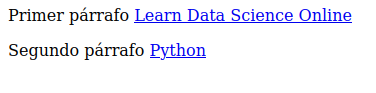

# Beautiful Soup

## Web scraping 

Internet es una fuente de datos absolutamente masiva, datos a los que podemos acceder mediante el web scraping y Python.

De hecho, el web scraping es a menudo la única forma de acceder a los datos. Hay mucha información ahí fuera que no está disponible mediante cómodas exportaciones CSV o APIs fáciles de conectar. Además, los propios sitios web son a menudo valiosas fuentes de datos. Pensemos, por ejemplo, en el tipo de análisis que se podría hacer si pudieramos descargar todos los mensajes de un foro web.

Para acceder a este tipo de conjuntos de datos en la página, tendremos que utilizar el web scraping.


### Fundamentos del web scraping

Algunos sitios web ofrecen conjuntos de datos que se pueden descargar en formato CSV, o que son accesibles a través de una [interfaz de programación de aplicaciones (API)](https://en.wikipedia.org/wiki/API). Pero muchos sitios web con datos útiles no ofrecen este tipo de opciones.

Veamos, por ejemplo, el caso del sitio web del Servicio Meteorológico Nacional de EEUU. Contiene previsiones meteorológicas actualizadas para todos los lugares de Estados Unidos, pero esos datos meteorológicos no son accesibles en formato CSV ni a través de la API. Hay que verlos en el propio sitio del NWS:


Si quisiéramos analizar estos datos, o descargarlos para utilizarlos en alguna otra aplicación, no querríamos copiar y pegar todo a mano. El "web scraping" es una técnica que nos permite utilizar la programación para hacer el trabajo pesado. 

Vamos a escribir un código que busque en el sitio del NWS, coja sólo los datos con los que queremos trabajar y los proporcione en el formato que necesitamos.

Cuando hacemos scraping de la web, escribimos un código que envía una petición al servidor que aloja la página que hemos especificado. El servidor devolverá el código fuente - HTML, principalmente - de la página (o páginas) que hemos solicitado.

Hasta aquí, estamos haciendo esencialmente lo mismo que hace un navegador web: enviar una petición al servidor con una URL específica y pedirle que nos devuelva el código de esa página.

Pero a diferencia de un navegador web, nuestro código de web scraping no interpretará el código fuente de la página y la mostrará visualmente. En su lugar, escribiremos un código personalizado que filtrará dicho código fuente en busca de los elementos concretos que hayamos especificado y extraerá el contenido que le hayamos indicado.

Por ejemplo, si quisiéramos obtener todos los datos del interior de una tabla que se muestra en una página web, nuestro código se escribiría para seguir estos pasos en secuencia:

+ Solicitar al servidor el contenido (código fuente) de una URL específica
+ Descargar el contenido devuelto
+ Identificar los elementos de la página que forman parte de la tabla que queremos
+ Extraer y (si es necesario) reformatear esos elementos en un conjunto de datos que podamos analizar o utilizar de la forma que queramos.

Si todo esto suena muy complicado, no hay de qué preocuparse, Python y Beautiful Soup tienen funciones integradas diseñadas para que esto sea relativamente sencillo.

Una cosa que es importante tener en cuenta: desde la perspectiva de un servidor, solicitar una página a través de web scraping es lo mismo que cargarla en un navegador web. Cuando usamos código para enviar estas peticiones, podemos estar "cargando" páginas mucho más rápido que un usuario normal, y por tanto consumiendo rápidamente los recursos del servidor del propietario del sitio web.

### ¿Es legal el Web Scraping?

Desafortunadamente, no hay una respuesta clara en este aspecto. Algunos sitios web permiten explícitamente el web scraping mientras que otros lo prohíben explícitamente. Muchos sitios web no ofrecen ninguna orientación clara en un sentido u otro.

Antes de hacer scraping de cualquier sitio web, debemos buscar una página de términos y condiciones para ver si hay normas explícitas sobre el scraping. Si las hay, debemos cumplirlas. Si no las hay, se trata más bien de una cuestión de criterio.

Sin embargo, hay que recordar que el scraping consume recursos del servidor del sitio web anfitrión. Si sólo hacemos scraping de una página una vez, eso no va a causar un problema. Pero si nuestro código está haciendo scraping de 1.000 páginas una vez cada diez minutos, eso rápidamente podría convertirse en un problema de costes para el propietario del sitio web.


Por lo tanto, además de seguir todas y cada una de las reglas explícitas sobre el web scraping publicadas en el sitio, también es una buena idea seguir una serie de buenas prácticas recomendadas:

+ Nunca hacer scraping con más frecuencia de la necesaria.
+ Considerar la posibilidad de almacenar en caché el contenido que se obtenga procedente el scraping para que sólo se descargue una vez.
+ Incorpora pausas en tu código utilizando funciones como `time.sleep()` para no abrumar a los servidores con demasiadas peticiones demasiado rápido.

En el ejemplo que nos ocupa, los datos del NWS son de dominio público y sus condiciones no prohíben el scraping de la web, por lo que estamos en condiciones de proceder.

### Componentes de una página web 

Antes de empezar a escribir código, necesitamos entender un poco acerca de la estructura de una página web ya que es lo que utilizaremos los datos deseados cuando hagamos scraping.

Cuando visitamos un sitio web, nuesro navegador hace una petición a un servidor web. Esta petición será de tipo `GET` puesto que estamos obteniendo ficheros del servidor. El servidor envía de vuelta al navegador los ficheros que le indican cómo tiene que renderizar la página para el usuario. Estos archivos típicamente incluirán:

+ HTML: el contenido principal de la página

+ CSS: usado para añadir estilos a las páginas y mejorar su aspecto

+ JS: Javascript añade interactividad a la página web.

+ Imágenes: Para ser mostradas en el sitio

Como hemos dicho ya, tras recibir los archivos, el navegador renderiza la página y la muestra.

A la hora de llevar a cabo el scrapig, estamos interesados en el contenido principal de la web así que miraremos principalmente el código HTML.

## HTML

HTML es el lenguaje en el que están creados los sitios web. No se tata de un lenguaje de programación como pueda serlo Python. Es un lenguaje de marcado que le dice al navegador como mostrar contenido.

HTML tiene varias que son similiares a lo que se pudiera hacer con un procesador de textos (negrita, párrafos...).

Hagamos un rapidísimo repaso de HTML.

HTML está formado por elementos llamados **tags o etiquetas**. El más básico es `<html>` y es el que le indica al navegador que todo lo que vaya dentro de él es HTML. Así pues, el documento HTML más simple sería:

```html
<html>
</html>
```

No hemos añadido contenido a nuestra página todavía así que este documento HTML no mostraría nada en un navegador. Podemos poner más etiquetas dentro de las etiquetas `html`:

```html
<html>
<head>
</head>
<body>
</body>
</html>
```

El contenido principal del sitio web lo podremos encontrar dnetro de las etiquetas `body`. La etiqueta `head` contiene información acerca dle título de la página así como otro tipo de información no útil para el web scraping.

Añadamos ahora un párrafo dentro del body con su correspondiente etiqueta `p`:

```html
<html>
<head>
</head>
<body>
<p>
Primer párrafo
</p>
<p>
Segundo párrafo
</p>
</body>
</html>
```

Podemos además añadir propiedades a las etiquetas HML que cambien su comportamiento. Añadamos ahora hiperenlaces con la etiqueta `a`:

```html
<html>
<head>
</head>
<body>
<p>
Primer párrafo
<a href="https://www.dataquest.io">Learn Data Science Online</a>
</p>
<p>
Segundo párrafo
<a href="https://www.python.org">Python</a> </p>
</body>
</html>
```

Que se verá así:



En el ejemplo anterio la etiqueta `a` indica que se trata de un link y la propiedad `href` determina a donde apunta ese link.

Otras etiquetas comunes son:

+ div: indica una división o área de la página
+ b: texto en negrita
+ i: texto en cursiva
+ table: crea una tabla
+ form: crea un formulario

[Aquí](https://developer.mozilla.org/en-US/docs/Web/HTML/Element) podéis encontrar la lista completa de tags o etiquetas.

Para acabar con el apartado dedicado a HTML, debemos hablar de las propiedades `class` y `id`. Estas propiedade especiales proporciona nombres a los elementos HTML, haciendo así más fácil interactuar con ellos a la hora de hacer scraping.

Un elemento puede tener multiples clases y una clase puede ser compartida entre elementos. Cada elemento sólo puede tener un único id y un id sólo puede usarse una vez por página.  

Estos `class` y `id` son opcinoales y no todos los elementos los tendrán. Sobre el ejemplo anterior:

```html
<html>
<head>
</head>
<body>
<p class="bold-paragraph">
Primer párrafo
<a href="https://www.dataquest.io" id="learn-link">Learn Data Science Online</a>
</p>
<p class="bold-paragraph extra-large">
Segundo párrafo
<a href="https://www.python.org" class="extra-large">Python</a>
</p>
</body>
</html>
```

Estas propiedades no modifican la forma en que se ve la página en el navegador.

## Parseando páginas con BeatifulSoup

El parsing no es más que un análisis sintáctico, [como podéis leer aquí](https://es.wikipedia.org/wiki/Analizador_sint%C3%A1ctico)