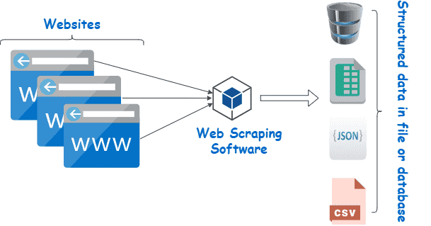
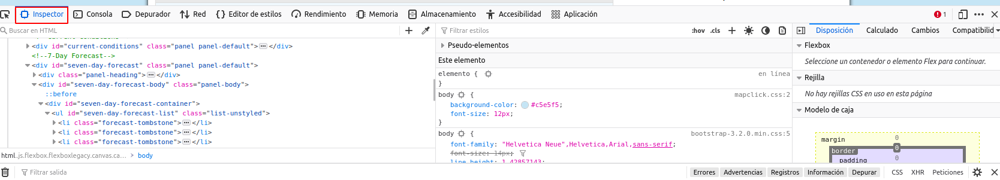

# Beautiful Soup

## Web scraping 

Internet es una fuente de datos absolutamente masiva, datos a los que podemos acceder mediante el web scraping y Python.

De hecho, el web scraping es a menudo la única forma de acceder a los datos. Hay mucha información ahí fuera que no está disponible mediante cómodas exportaciones CSV o APIs fáciles de conectar. Además, los propios sitios web son a menudo valiosas fuentes de datos. Pensemos, por ejemplo, en el tipo de análisis que se podría hacer si pudieramos descargar todos los mensajes de un foro web.

Para acceder a este tipo de conjuntos de datos en la página, tendremos que utilizar el web scraping.


### Fundamentos del web scraping

Algunos sitios web ofrecen conjuntos de datos que se pueden descargar en formato CSV, o que son accesibles a través de una [interfaz de programación de aplicaciones (API)](https://en.wikipedia.org/wiki/API). Pero muchos sitios web con datos útiles no ofrecen este tipo de opciones.

Veamos, por ejemplo, el caso del sitio web del Servicio Meteorológico Nacional de EEUU. Contiene previsiones meteorológicas actualizadas para todos los lugares de Estados Unidos, pero esos datos meteorológicos no son accesibles en formato CSV ni a través de la API. Hay que verlos en el propio sitio del NWS:


Si quisiéramos analizar estos datos, o descargarlos para utilizarlos en alguna otra aplicación, no querríamos copiar y pegar todo a mano. El "web scraping" es una técnica que nos permite utilizar la programación para hacer el trabajo pesado. 

Vamos a escribir un código que busque en el sitio del NWS, coja sólo los datos con los que queremos trabajar y los proporcione en el formato que necesitamos.

Cuando hacemos scraping de la web, escribimos un código que envía una petición al servidor que aloja la página que hemos especificado. El servidor devolverá el código fuente - HTML, principalmente - de la página (o páginas) que hemos solicitado.

Hasta aquí, estamos haciendo esencialmente lo mismo que hace un navegador web: enviar una petición al servidor con una URL específica y pedirle que nos devuelva el código de esa página.

Pero a diferencia de un navegador web, nuestro código de web scraping no interpretará el código fuente de la página y la mostrará visualmente. En su lugar, escribiremos un código personalizado que filtrará dicho código fuente en busca de los elementos concretos que hayamos especificado y extraerá el contenido que le hayamos indicado.

Por ejemplo, si quisiéramos obtener todos los datos del interior de una tabla que se muestra en una página web, nuestro código se escribiría para seguir estos pasos en secuencia:

+ Solicitar al servidor el contenido (código fuente) de una URL específica
+ Descargar el contenido devuelto
+ Identificar los elementos de la página que forman parte de la tabla que queremos
+ Extraer y (si es necesario) reformatear esos elementos en un conjunto de datos que podamos analizar o utilizar de la forma que queramos.

Si todo esto suena muy complicado, no hay de qué preocuparse, Python y Beautiful Soup tienen funciones integradas diseñadas para que esto sea relativamente sencillo.

Una cosa que es importante tener en cuenta: desde la perspectiva de un servidor, solicitar una página a través de web scraping es lo mismo que cargarla en un navegador web. Cuando usamos código para enviar estas peticiones, podemos estar "cargando" páginas mucho más rápido que un usuario normal, y por tanto consumiendo rápidamente los recursos del servidor del propietario del sitio web.

### ¿Es legal el Web Scraping?

Desafortunadamente, no hay una respuesta clara en este aspecto. Algunos sitios web permiten explícitamente el web scraping mientras que otros lo prohíben explícitamente. Muchos sitios web no ofrecen ninguna orientación clara en un sentido u otro.

Antes de hacer scraping de cualquier sitio web, debemos buscar una página de términos y condiciones para ver si hay normas explícitas sobre el scraping. Si las hay, debemos cumplirlas. Si no las hay, se trata más bien de una cuestión de criterio.

Sin embargo, hay que recordar que el scraping consume recursos del servidor del sitio web anfitrión. Si sólo hacemos scraping de una página una vez, eso no va a causar un problema. Pero si nuestro código está haciendo scraping de 1.000 páginas una vez cada diez minutos, eso rápidamente podría convertirse en un problema de costes para el propietario del sitio web.



Por lo tanto, además de seguir todas y cada una de las reglas explícitas sobre el web scraping publicadas en el sitio, también es una buena idea seguir una serie de buenas prácticas recomendadas:

+ Nunca hacer scraping con más frecuencia de la necesaria.
+ Considerar la posibilidad de almacenar en caché el contenido que se obtenga procedente el scraping para que sólo se descargue una vez.
+ Incorpora pausas en tu código utilizando funciones como `time.sleep()` para no abrumar a los servidores con demasiadas peticiones demasiado rápido.

En el ejemplo que nos ocupa, los datos del NWS son de dominio público y sus condiciones no prohíben el scraping de la web, por lo que estamos en condiciones de proceder.

### Componentes de una página web 

Antes de empezar a escribir código, necesitamos entender un poco acerca de la estructura de una página web ya que es lo que utilizaremos los datos deseados cuando hagamos scraping.

Cuando visitamos un sitio web, nuesro navegador hace una petición a un servidor web. Esta petición será de tipo `GET` puesto que estamos obteniendo ficheros del servidor. El servidor envía de vuelta al navegador los ficheros que le indican cómo tiene que renderizar la página para el usuario. Estos archivos típicamente incluirán:

+ HTML: el contenido principal de la página

+ CSS: usado para añadir estilos a las páginas y mejorar su aspecto

+ JS: Javascript añade interactividad a la página web.

+ Imágenes: Para ser mostradas en el sitio

Como hemos dicho ya, tras recibir los archivos, el navegador renderiza la página y la muestra.

A la hora de llevar a cabo el scrapig, estamos interesados en el contenido principal de la web así que miraremos principalmente el código HTML.

## HTML

HTML es el lenguaje en el que están creados los sitios web. No se tata de un lenguaje de programación como pueda serlo Python. Es un lenguaje de marcado que le dice al navegador como mostrar contenido.

HTML tiene varias que son similiares a lo que se pudiera hacer con un procesador de textos (negrita, párrafos...).

Hagamos un rapidísimo repaso de HTML.

HTML está formado por elementos llamados **tags o etiquetas**. El más básico es `<html>` y es el que le indica al navegador que todo lo que vaya dentro de él es HTML. Así pues, el documento HTML más simple sería:

```html
<html>
</html>
```

No hemos añadido contenido a nuestra página todavía así que este documento HTML no mostraría nada en un navegador. Podemos poner más etiquetas dentro de las etiquetas `html`:

```html
<html>
<head>
</head>
<body>
</body>
</html>
```

El contenido principal del sitio web lo podremos encontrar dnetro de las etiquetas `body`. La etiqueta `head` contiene información acerca dle título de la página así como otro tipo de información no útil para el web scraping.

Añadamos ahora un párrafo dentro del body con su correspondiente etiqueta `p`:

```html
<html>
<head>
</head>
<body>
<p>
Primer párrafo
</p>
<p>
Segundo párrafo
</p>
</body>
</html>
```

Podemos además añadir propiedades a las etiquetas HML que cambien su comportamiento. Añadamos ahora hiperenlaces con la etiqueta `a`:

```html
<html>
<head>
</head>
<body>
<p>
Primer párrafo
<a href="https://www.dataquest.io">Learn Data Science Online</a>
</p>
<p>
Segundo párrafo
<a href="https://www.python.org">Python</a> </p>
</body>
</html>
```

Que se verá así:


En el ejemplo anterio la etiqueta `a` indica que se trata de un link y la propiedad `href` determina a donde apunta ese link.

Otras etiquetas comunes son:

+ div: indica una división o área de la página
+ b: texto en negrita
+ i: texto en cursiva
+ table: crea una tabla
+ form: crea un formulario

[Aquí](https://developer.mozilla.org/en-US/docs/Web/HTML/Element) podéis encontrar la lista completa de tags o etiquetas.

Para acabar con el apartado dedicado a HTML, debemos hablar de las propiedades `class` y `id`. Estas propiedade especiales proporciona nombres a los elementos HTML, haciendo así más fácil interactuar con ellos a la hora de hacer scraping.

Un elemento puede tener multiples clases y una clase puede ser compartida entre elementos. Cada elemento sólo puede tener un único id y un id sólo puede usarse una vez por página.  

Estos `class` y `id` son opcinoales y no todos los elementos los tendrán. Sobre el ejemplo anterior:

```html
<html>
<head>
</head>
<body>
<p class="bold-paragraph">
Primer párrafo
<a href="https://www.dataquest.io" id="learn-link">Learn Data Science Online</a>
</p>
<p class="bold-paragraph extra-large">
Segundo párrafo
<a href="https://www.python.org" class="extra-large">Python</a>
</p>
</body>
</html>
```

Estas propiedades no modifican la forma en que se ve la página en el navegador.

## Parseando páginas con BeatifulSoup

El parsing no es más que un análisis sintáctico, [como podéis leer aquí](https://es.wikipedia.org/wiki/Analizador_sint%C3%A1ctico)

Supongamos que descargamos la siguiente página usando la biblioteca Requests que ya hemos visto:

```python
import requests
page = requests.get("https://dataquestio.github.io/web-scraping-pages/simple.html")
page
```

Podemos utilizar la biblioteca [BeautifulSoup](https://www.crummy.com/software/BeautifulSoup/bs4/doc/) para *parsear* este documento y extraer el texto de la etiqueta `p`.

Lo primero que deberemos hacer, como siempre, es instalar BeautifulSoup. Podemos hacerlo en nuestro entorno virtual:

O de forma general en nuestra máquina:

```python
pipenv shell
pipenv install beautifulsoup4
```
Ahora, en el entorno interactivo de python, podemos proceder:


Lo que hemos hecho ha sido importar la biblioteca y crear una instancia de la clase BeautifulSoup para parsear nuestro documento. Tras ello, hemos mostrado por pantall el contenido de la página de una forma un poco más *bonita* utilizando el método `prettify` del objeto `BeautifulSoup`.

Este último paso no es estrictamente necesario aunque a veces pueda ayudarnos para que sea más fácil entender la estructura de las etiquetas de la página y el anidado entre ellas.

Con la propiedad `children` de `soup` podemos seleccionar los elementos del nivel más alto. Estos elementos se devuelven en forma de lista, por lo que necesitaremos la función `list`:

```python
list(soud.children)
```

El resultado del comando de arriba nos indicará que hay dos etiquetas de nivel superior, la etiqueta inicial `<!DOCTYPE html>` y la etiqueta `<html>`. Además aparece un carácter de nueva línea `\n` en la lista también. 

Para saber qué tipo de dato es cada elemento, podemos iterar sobre la lista:

```python
[type(item) for item in list(soup.children)]
```

Veremos de esta forma que que los elementos de la lista son objetos de BeautifulSoup:

+ El primero es un objeto `Doctype`, que contiene información sobre el tipo de documento

+ El segundo es del tipo `NavegableString`, que indica que se ha encontrado texto el documento HTML.

+ El elemento final es un `Tag`, que contiene otros tags anidados.

El tipo de objeto más importante y con el que lidiaremos más a menudo es el objeto `Tag`.

El objeto Tag nos permite navegar a través de un documento HTML y extraer otros tags o textos. 

[Aquí una lista](https://www.crummy.com/software/BeautifulSoup/bs4/doc/#kinds-of-objects) con los tipos de objetos de BeatifulSoup.


Podemos seleccionar ahora el tag html y sus hijos seleccionando el tercer elemnto de la lista:

```python
html = list(soup.children)[2]
```

Cada elemento devuelto por la porpiedad `children` es también un objeto BeautifulSoup, así que podremos seguir invocando el método `children` sobre `html`

```python
list(html.children)
```

Y podremos seguir iterando sobre los tags anidados hasta aislar el tag `p` que es el que nos interesa

```python
body = list(html.children)[3]

list(body.children)

p = list(body.children)[1]
```
_
Y una vez aislado, usamos el método `get_text` para extraer todo el texto que deseamos:

```python
p.get_text()
```

### Encontrar todas las instancias de una etiqueta o tag a la vez

El proceso que hemos seguido arriba es útil pero tedioso y poco eficiente. Es por ello, que si quisiéramos extraer todas las instancias de un tag dentro de una página, podemos utilizar el método `find_all`:

```python
soup = BeautifulSoup(page.content, 'html.parser')
soup.find_all('p')
```

Este método devuelve una lista, así que tendremos que iterar sobre ella o usar índices para extraer el texto:

```python
soup.find_all('p')[0].get_text()
```

Para encontrar la primera instancia que aparece en la página de un determinado tag, usaremos el método `find`, que devuelve un único objeto BeautifulSoup:

```python
soup.find('p')
```

### Buscando etiquetas usando "class" y "id"

Estos dos elementos, introducidos con anteriorirdad, se usan en CSS para determinar a qué elementos HTML se están aplicando ciertos estiles. Pero cuando estamos haciendo *scraping* también podemos usarlos para escpeificar los elementos que queremos *scrapear*.

Para ilustrar esta sección, vamos a trabajar con la siguiente página:

```html
<html>
    <head>
        <title>A simple example page</title>
    </head>
    <body>
        <div>
            <p class="inner-text first-item" id="first">
                First paragraph.
            </p>
            <p class="inner-text">
                Second paragraph.
            </p>
        </div>
            <p class="outer-text first-item" id="second">
                <b>
                First outer paragraph.
                </b>
            </p>
            <p class="outer-text">
                <b>
                Second outer paragraph.
                </b>
            </p>
    </body>
</html>
```

Que podemos encontrar [aquí](https://dataquestio.github.io/web-scraping-pages/ids_and_classes.html).

Seguimos el mismo modus operandi, descargamos la página y creamos un objeto BeautifulSoup:

```python
page = requests.get("https://dataquestio.github.io/web-scraping-pages/ids_and_classes.html")
soup = BeautifulSoup(page.content, 'html.parser')
soup
```

Ahora, para encontrar todos los elementos con el tag `p` con un *class* igual a `outer-text`:

```python
soup.find_all('p', class_='outer-text')sssssssssssssssssssss
```

O simplemente cualquier tag con ese *class*:

```python
soup.find_all(class_="outer-text")
```

O buscar también por *id*:

```python
soup.find_all(id="first")
```


### Usando selectores CSS

También podemos buscar elementos usando los [selectores CSS](https://developer.mozilla.org/en-US/docs/Learn/CSS/Building_blocks/Selectors). Mediante estos selectores el *lenguaje* CSS permite a los desarrolladores especificar las etiquetas HTML a las que aplicar estilos. Algunos ejemplos:

+ `p a`: encuentra todos los tags `a` dentro de un tag `p`
+ `body p a`: encuentra todos los tags `a` dentro de un tag `p` dentro de un tag `body`
+ `html body `: encuentra todos los tags `body` dentro deun tag `html`
+ `p.outer-text `: encuentra todos los tags `p` con la class `outer-text`
+ `p#first`: encuentra todos los tags `p` con un id `first`
+ `body p.outer-text`: encuentra todos los tags `p` con la class `outer-text` dentro de un tag `body`

BeautifulSoup soporta la búsqueda en una página usando selectores CSS usando el método `select`. Podemos usar estos selectores para encontrar todos los tags `p` de nuestra página que esté dentro de un `div` tal que así:

```python
soup.select("div p")
```

!!!note Nota
    El método `select` de arriba devuelve una lista de objetos BeautifulSoup, igual que `find` y `find_all`


## Ejemplo práctico: Scraping de datos meteorológicos

Para este ejemplo se utilizará la página de información del [tiempo de San Francisco](https://forecast.weather.gov/MapClick.php?lat=37.7772&lon=-122.4168)


Como vemos en la imagen, la página contiene información ampliada de la previsión meteorológica para la semana que viene, incluyendo cosas como la temperatura o una breve descripción de las condiciones.

### Explorando la estructura de la página con las herramientas de desarrollador

Para acceder a las herramientas de desarrollador de nuestro navegador podemos apretar simplemente **F12** o podemos encontrarlas en *Herramientas > Herramientas del navegador > Herramientas para desarrolladores web* (en Firefox, en otros navegadores será similar).

Si os colocáis sobre la pestaña *Inspector*, se os mostrarán todas las etiquetas/tags de la página y podréis navegar por ellas:



Si hacemos click derecho en la página, cerca de donde pone *Extended forecast* y le decimos *Inspeccinoar*, se nos abrirá el tag donde están contenidos esos elementos:


En la pestaña de *Elements* también podemos ir navegando por los distintos elementos para encontrar el que contiene todo el texto que corresponde con la información del tiempo ampliada (extended forecasts). En este caso, como véis en la imagen de arriba, se trata de un `div` con el id `seven-day-forecast`.

Si trasteamos un poco en la consola, podremos explorar el diva y descubiremos que cada elemento del tiempo (Tonight, Thursday, Thursday night...) está contenido en un `div` con la class `tombstone-container`.

#### ¡Empecemos con el scraping!

Ya tenemos todo lo que ncesitamos para descargarnos la página y empezar a parsear como si no hubiera un mañana. Lo que haremos, será:

1. Descargar la página web que contiene la previsión del tiempo
2. Crear una clase BeautifulSoup para parsear la página
3. Encontrar el `div` con id `seven-day-forecast` y asignarlo a la variable `seven_day`
4. Dentro de `seven_day` deberemos encontrar cada elemento indiivdual de la previsión del tiempo
5. Extraer e imprimir el primero de estos elementos

Esto, traducido a código Python, sería:

```python
pagina = requests.get("https://forecast.weather.gov/MapClick.php?lat=37.7772&lon=-122.4168")
soup = BeautifulSoup(pagina.content, 'html.parser')
seven_day = soup.find(id="seven-day-forecast")
elementos_clima = seven_day.find_all(class_="tombstone-container")
tonight = elementos_clima[0]
print(tonight.prettify())
```
##### Extraer información concreta de la página

Vemos que dentro del elemento `tonight` está toda la información que deseamos. Hay cuatro piezas de información que podemos extraer:

+ El nombre del elemento, en este caso `Tonight`
+ La descripción de las condiciones, almacenadas en la propiedad `title` de `img`
+ Una breve descripción de las condiciones, en este caso `Mostly Clear`
+ La mínima de temperatura, en este caso 58ºF

Para extraer pues la información más relevante, siguiendo con el ejemplo anterior, podemos hacer:

```python
periodo = tonight.find(class_="period-name").get_text()
desc_corta = tonight.find(class_="short-desc").get_text()
temp = tonight.find(class_="temp").get_text()
print(periodo)
print(desc_corta)
print(temp)
```
Ahora, podemos extraer el atributo `title` de la etiqueta `img`. Para hacer esto, trataremos al objeto BeautifulSoup como un diccinoario y le pasaremos el atributo que queremos como una clave:

```python
img = tonight.find("img")
desc = img['title']
print(desc)
```
##### Extraer toda la información de la página


```python

```

```python

```

```python

```

```python

```

```python

```

```python

```

```python

```

```python

```

```python

```

```python

```

```python

```

```python

```

```python

```

```python

```

## Referencias

[Web Scraping with Python Using Beautiful Soup](https://www.dataquest.io/blog/web-scraping-python-using-beautiful-soup/)