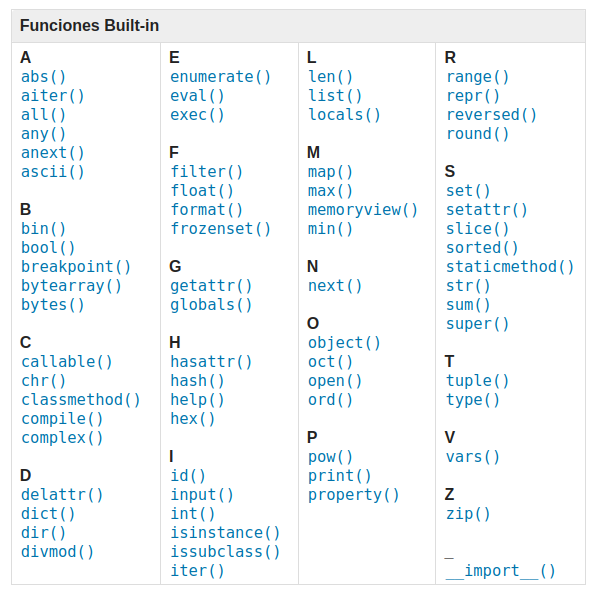

# Funciones
Una función es un grupo de sentencias que realizan una tarea concreta. Esta forma de agrupar código es una forma de **ordenar** nuestra aplicación en pequeños bloques, **facilitando así su lectura** y permitiendo **reutilizar** el código que contienen sin esfuerzo.

## Definir y llamar a una función

La sintaxis de una función en Python es la siguiente:

```python
def saludo(nombre):
# codigo de la función
    print("Hola, " + nombre+ ". ¡Bienvenido!")
```
	
Se escribe la palabra reservada `def` seguida del nombre de la función y sus parámetros entre paréntesis.

Para **llamar a una función** solo hay que escribir el nombre de la función seguida de los parámetros (si los hubiera) entre paréntesis.

```python
>>> saludo('Maitane')
Hola, Maitane. ¡Bienvenida!
```

Es posible asignar al parámetro un **valor por defecto**.

```python
def saludo(nombre = "Anónimo"):  
    print("Hola, " + nombre+ ". ¡Bienvenido!")

saludo("Leire") # Hola, Maitane. ¡Bienvenida!
saludo() # Hola, Anónimo. ¡Bienvenida!
```
Existen dos tipos de parámetros o argumentos:

- **Parámetros posicionales**: la posición en la que se pasan importa
- **Parámetros con palabra clave (keyword arguments)**: la posición no
   importa, se indica una clave para cada parámetro.

```python
def suma(a, b):
	resultado = a + b
	print(resultado)
suma(45, 20) # parámentros posicionales
suma(b=20,a=45) # parametros mediante clave
```

Las funciones pueden **devolver un valor** utilizando la palabra `return`. Una vez devuelto un valor, la función finaliza su ejecución.

```python
def suma(a, b):
	resultado = a + b
	return resultado

print(suma(4,5)) # 9
```

## Funciones con argumentos múltiples

Es posible recibir un **número desconocido** de parámetros añadiendo un `*` en la definición de la función.

```python
def suma_todo(*args):
    resultado = 0
    for i in args:
        resultado += i
        return resultado
v, w, x, y, z = 5, 2, 12, 6, 9
total = suma_todo(v, w, x, y, z)
print("La suma total es:" + str(total))  # La suma total es: 34
```

## Ámbito de las variables (scope)
El ámbito de una variable (*scope*) se refiere a la zona del programa dónde una variable "existe". Fuera del ámbito de una variable no podremos acceder a su valor ni manejarla.

Los parámetros y variables definidos en una función no estarán accesibles fuera de la función. A este ámbito se le conoce como **ámbito local**. Es importante mencionar que una vez ejecutada una función, el valor de las variables locales no se almacena, por lo que la próxima vez que se llame a la función, ésta no recordará ningún valor de llamadas anteriores.

```python
def calcula():
    a = 1
    print("Dentro de la función:", a)

a = 5
calcula()
print("Fuera de la función:", a)

### Output ###
# Dentro de la función:1
# Fuera de la función:5
```

Por el contrario, las variables definidas fuera de una función sí que están accesibles desde dentro de la función. Se considera que están en el **ámbito global**. No obstante, no se podrán modificar dentro de la función a no ser que estén definidas con la palabra clave `global`.

## Funciones internas

Python proporciona un número importante de funciones denominadas *built-in* o internas, que pueden ser usadas sin necesidad de tener que definirlas previamente. 

Los creadores de Python han escrito este conjunto de funciones para resolver problemas comunes y las han incluido en Python para que las podamos utilizar.

Un ejemplo son las funciones `max` y `min` nos darán respectivamente el valor mayor y menor de una lista.

Dependiendo de la versión de Python utilizada, la lista podrá diferir. Para `Python 3.10.6` estas funciones son:



Y el funcionamiento de cada una de ellas puede consultarse [aquí](https://docs.python.org/es/3/library/functions.html).

## ¿Por qué necesitamos las funciones?

Puede no estar muy claro por qué merece la pena molestarse en dividir un programa en funciones. Existen varias razones:

+ El crear una función nueva te da la oportunidad de dar nombre a un grupo de sentencias, lo cual hace tu programa más fácil de leer, entender y depurar. Las funciones pueden hacer un programa más pequeño, al eliminar código repetido. Además, si quieres realizar cualquier cambio en el futuro, sólo
tendrás que hacerlo en un único lugar.

+ Dividir un programa largo en funciones te permite depurar las partes de una en una y luego ensamblarlas juntas en una sola pieza.
  
+ Las funciones bien diseñadas a menudo resultan útiles para otros muchos programas. Una vez que has escrito y depurado una, puedes reutilizarla.
  
Parte de la habilidad de crear y usar funciones consiste en llegar a tener una función que represente correctamente una idea, como “encontrar el valor más pequeño en una lista de valores”, por ejemplo.


## Coding time!

### Ejercicio 1
Crea un programa que determine si un número es primo o no. Deberás crear la función `esPrimo()` que reciba como parámetro un número y devuelva `True` o `False` indicando si el número es primo o no.

### Ejercicio 2
Crea un programa que genere un número aleatorio del 1 al 10. El usuario tendrá que adivinarlo, y el programa tras cada intento le indicará al usuario si el número es más alto, bajo o si ha acertado. La lógica para dar la respuesta al usuario deberá estar incluida en una función a la que se llamará tras cada intento.

Nota: Para la creación del número aleatorio, utiliza el siguiente código:

```python
from random import randint, uniform,random

numero = randint(0,10)
```

### Ejercicio 3
Crea un programa que reciba un número del 1 al 20 introducido por el usuario y compruebe si está dentro de la siguiente lista: `[6,14,11,3,2,1,15,19]`. Implementa una función que se asegure que el número introducido por el usuario está en el rango indicado y otra que compruebe si está dentro de la lista. Trata de crear las funciones de forma que puedan ser reutilizadas lo máximo posible en otros programas.


## Funciones integradas

Además, Python posee unas funciones denominadas *built-in* o integradas en el propio lenguaje. Dependiendo de la versión de Python utilizada, la lista podrá diferir. Para `Python 3.10.6` estas funciones son:


Y el funcionamiento de cada una de ellas puede consultarse [aquí](https://docs.python.org/es/3/library/functions.html).