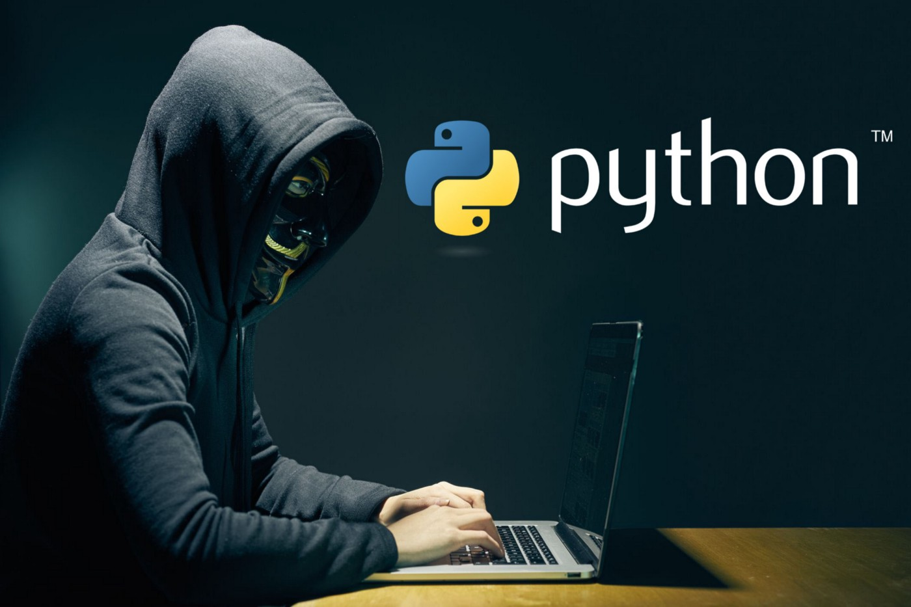
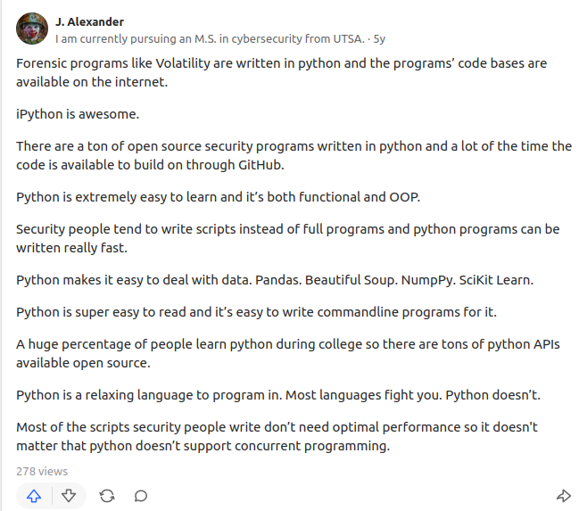
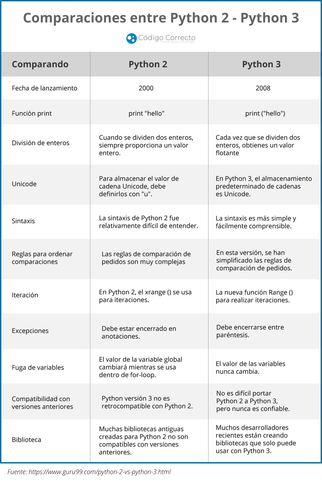
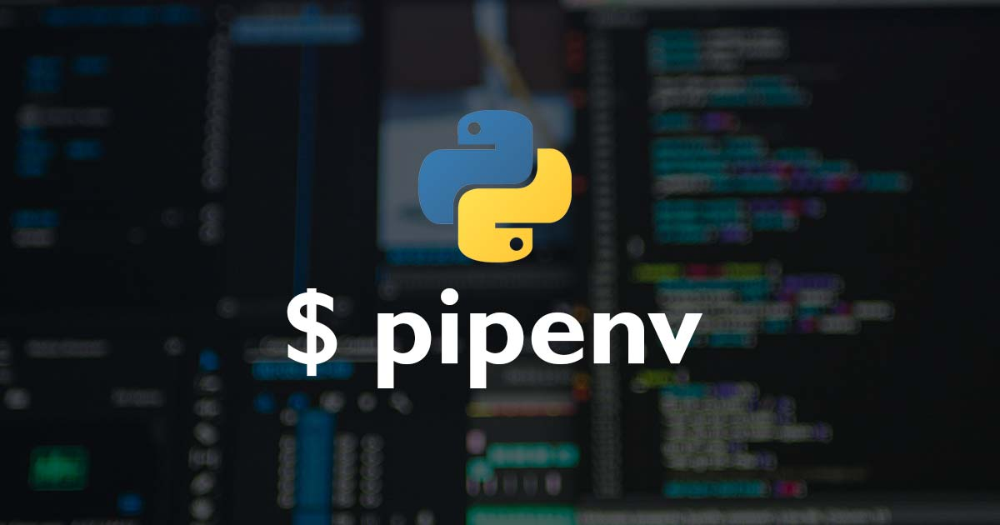

## ¿Por qué Python?

En términos generales, Python tiene una serie de beneficios que conviene destacar y que lo han convertido casi en estándar de facto en distintos campos como la ciberseguridad, por ejemplo.

Algunos de estos beneficios son:

### Python es fácil de aprender e implementar

Python fue diseñado intencionadamente para ser un lenguaje de programación sencillo, fácil y, en general, ligero, que requiriera un código mínimo para realizar las tareas en comparación con otros lenguajes. 

El hecho es que Python a menudo requiere mucho menos código que el que se requeriría de otros lenguajes de programación, como C o Java. La naturaleza de Python da lugar a una curva de aprendizaje más corta para cualquiera que trabaje con el lenguaje, especialmente para aquellos que son nuevos en la programación.

### Python facilita el debugging o depuración

Ya hemos hablado del hecho de que la estructura de Python hace que sea más fácil de aprender e implementar, pero esa naturaleza básica también tiene otros beneficios.

El diseño directo de Python y su facilidad de uso también aumentan su legibilidad. El aumento de la legibilidad también hace que la depuración del código sea mucho más sencilla, lo que significa que incluso los programadores de bajo nivel o principiantes pueden solucionar problemas y depurar su propio código con bastante eficacia y que la corrección de errores puede llevernos mucho menos tiempo en general.

### Es open source

Python fue desarrollado como un lenguaje de programación de código abierto, de forma similar a Linux.

La naturaleza de código abierto de Python se presta a una fuerte comunidad de desarrolladores que apoyan el lenguaje y lo hacen avanzar. Dado que Python es de código abierto, hay una gran cantidad de información disponible, y el uso del lenguaje es gratuito.

### Manejo automático de la memoria

Otro beneficio de Python que algunas personas no tienen en cuenta es que tiene la gestión de la memoria incorporada automáticamente por diseño.

La gestión de memoria de Python se realiza internamente mediante su propio gestor. Esto significa que el programador y el usuario deben preocuparse menos por la gestión de la memoria, incluyendo factores como el almacenamiento en caché, la asignación de memoria y la segmentación.

{:width="300"}


## ¿Por qué Python en ciberseguridad?

Ya hemos hablado de las ventajas del lenguaje de programación Python, y de que se utiliza en muchos campos. Ahora vamos a profundizar en por qué Python es tan útil para el campo de la ciberseguridad.

<figure> 
     
    <figcaption>Auténtico hacker de élite megamacropro siendo muy chungo en Python</figcaption> 
</figure>


### Es un lenguaje interpretado

Esto quiere decir que no necesita ser compilado para cada arquitectura concreta, por lo que es mucho más fácil desarrollar scripts, pruebas de concepto o malware casi universal. Además, esto unido a que Python viene instalado por defecto en un gran número de distribuciones Linux, lo hacen muy atractivo tanto desde el punto de vista del atacante como del defenseor.

### Python se puede utilizar para prácticamente todo en ciberseguridad

Cualquier profesional de la ciberseguridad que sea un experto en Python, podrá llevar a cabo casi cualquier tarea que se proponga. 

Por ejemplo, Python puede utilizarse para crear payloads, para el análisis de malware, para la decodificación de paquetes, para el acceso a servidores, para el escaneo de redes o para el escaneo de puertos, entre otras cosas.

Python en ciberseguridad puede utilizarse también para la automatización, lo que hace que la fase de reconocimiento  o recopilación de información de un pentesting sea mucho más fácil y ahorre tiempo. 

Hay que pensar que en ciberseguridad, más que programas *completos*, se suelen desarrollar scripts rápidos y funcionales.


### La amplia variedad de librerías de Python

Como hemos descrito anteriormente, la facilidad de uso de Python es sin duda uno de los factores más importantes que lo convierten en un lenguaje de referencia para los profesionales de la ciberseguridad.  Pero ciertamente, la extensa biblioteca de módulos de Python es un factor principal también.

Python se ha convertido en un lenguaje muy conocido y utilizado, debido a su extensa biblioteca, lo que significa que los profesionales de la ciberseguridad no necesitan reinventar la rueda con tareas comunes y en la mayoría de los casos pueden encontrar rápidamente una herramienta de análisis de ciberseguridad o de pruebas de pentesting ya disponible.


### Python se puede usar para casi todo en ciberseguridad

Con un buen conocimiento de Python y de los conceptos de programación en general, los profesionales de la ciberseguridad pueden realizar casi cualquier tarea que necesiten utilizando código Python.

Por ejemplo, Python se utiliza mucho en el análisis de malware, el descubrimiento de hosts, el envío y la decodificación de paquetes, el acceso a servidores, el escaneo de puertos y el escaneo de redes, por nombrar sólo algunos. Teniendo en cuenta también que es tan eficaz en la creación de scripts, la automatización de tareas y el análisis de datos, es comprensible que Python haya aumentado su popularidad a medida que la ciberseguridad se ha vuelto más importante.


### Los scripts en Python son muy rápidos de desarrollar

Otro beneficio de Python que ayuda a los profesionales de la ciberseguridad es que la facilidad del código significa que los ciberprofesionales pueden desarrollar las soluciones que necesitan con una cantidad mínima de tiempo, y con un código bastante simplista.

Esto significa que, por ejemplo, desarrollar un script a modo de exploit como prueba de concepto para demostrar una vulnerabilidad detectada, puede llevar relativamente poco tiempo.


Y para finalizar, una buena y completa respuesta que he encontrado en Quora, lo describe perfectamente:

<figure> 
     
    <figcaption>Why is Python preferred by most of the cybersecurity personnels?</figcaption> 
</figure>


## ¿Python2 o Python3?

Python fue lanzado por primera vez en 1991 por el programador holandés Guido van Rossum. Desde entonces, ha sufrido muchos cambios. Hoy en día, hay tres versiones principales de Python. De ellas, sólo las dos últimas versiones -Python 2 y Python 3- siguen en uso.

Esto puede resultar confuso para los nuevos desarrolladores. ¿Qué se debería aprender, Python 2 o Python 3? Generalmente, la respuesta es la segunda, pero hay muchos casos en los que ayuda conocer la primera.

Exploraremos la historia y el desarrollo del lenguaje, las diferencias entre Python 2 y Python 3, y los casos de uso de cada uno en los párrafos siguientes.

### Historia de Python2 vs Python3

Python 2 apareció en el año 2000. La actualización del lenguaje se diseñó para facilitar el aprendizaje de la persona promedio, pero también agregó muchas características que los desarrolladores necesitaban, como la [comprensión de listas](https://j2logo.com/list-comprehensions-en-python/), el soporte de Unicode, la recolección de basura y el soporte mejorado para la programación orientada a objetos. Con todas estas ventajas, no fue difícil para los desarrolladores actualizar su código de Python 1 a Python 2.

Python 3 salió en 2008 después de que van Rossum encontrara nuevas formas de mejorar el lenguaje. En la programación se aprende sobre la marcha, y a veces los problemas sólo aparecen al final del proceso. Pero estas mejoras sólo podían hacerse con una nueva versión de Python que no fuera compatible con Python 2.

{:style widt=200}

La falta de retrocompatibilidad de Python 3 era un problema para muchos desarrolladores, ya que dependían de las bibliotecas de terceros escritas para soportar Python 2 para agilizar el desarrollo de sus aplicaciones. Dada la popularidad de Python y sus bibliotecas asociadas, el código de Python 2 estaba por todas partes, y era difícil conseguir que la gente hiciera el cambio.

La última versión de Python 2 se publicó en 2010, después del lanzamiento inicial de Python 3. Inicialmente, se suponía que el soporte para Python 2 terminaría en 2015, pero debido a que seguía siendo tan ampliamente utilizado, la fecha límite se retrasó hasta enero de 2020.

!!!warning "Resumiendo"
    Se debe aprender o seguir desarrollando en Python3 ya que Python2 está obsoleto y fuera de soporte. No obstante, mucho código legacy, librerías de terceros y, en nuestro caso, muchos exploits y pruebas de concepto siguen estando escritos en Python2, por lo que es necesario, al menos, conocerlo.

## Diferencias entre Python2 y Python3

Las diferencias pueden ser sustanciales en algunos casos. Dado que no es el objetivo de este curso, os dejo aquí [un sitio web](https://www.programaenpython.com/miscelanea/diferencias-entre-python-2-y-3/) donde se explican de una forma más o menos detalladas.

Esta imagen lo muestra de una form aresumida:

{: style="height:950px"}

Otros recursos, en inglés, para consultar las diferencias de forma detallada son [este](https://www.guru99.com/python-2-vs-python-3.html) y [este](https://www.geeksforgeeks.org/important-differences-between-python-2-x-and-python-3-x-with-examples/).

## Instalación de Python

Como era de esperar, es imprescindible tener instalado en nuestro sistema Python para poder utilizar Python, sorpresas nos da la vida. Dicho esto, veamos cómo hacerlo.

### Python3

En este curso yo trabajaré íntegramente con Python3 en Linux, lo cual no es óbice para que vosotros podáis usarlo en Windows, OSX o WSL si así lo deseáis. Una idea es utilizar una máquina virtual Linux o un contenedor Docker pero, de nuevo, sóis libres de elegir.

En la misma medida, el IDE que utilizaré será Visual Studio Code en Linux. Vosotros sóis libres de utilizar éste en Windows, Linux, OSX o cualquier otro IDE(como Anaconda por ejemplo) en cualquier sistema.

La instalación en **Windows** es igual de sencilla que cualquier otro software y podéis realizarsa siguiendo tutoriales como [este](https://www.digitalocean.com/community/tutorials/install-python-windows-10), [este](https://www.solvetic.com/tutoriales/article/11419-instalar-python-3-10-en-windows-11/) o [este](https://www.geeksforgeeks.org/download-and-install-python-3-latest-version/)

Para **Linux** y **MacOSX** en el último tutorial de los anteriores hay unas secciones dedicadas a ellos. Para Linux Debian o similares como Ubuntu y Mint, podéis seguir los pasos que se indican [aquí](https://computingforgeeks.com/how-to-install-python-on-ubuntu-linux-system/) o [aquí](https://noviello.it/es/como-instalar-python-3-10-en-ubuntu-debian-y-linux-mint/).

Para cualquier **Linux que no sea Debian**, probablemente no sea necesario daros instrucciones sobre cómo encontrar la forma de instalarlo.

### Ambientes virtuales y *pipenv*

### Entornos virtuales en Python 

Un entorno virtual es una forma de tener múltiples instancias paralelas del intérprete de Python, cada una con diferentes conjuntos de paquetes y diferentes configuraciones. Cada entorno virtual contiene una copia independiente del intérprete de Python, incluyendo copias de sus utilidades de soporte.

Los paquetes instalados en cada entorno virtual sólo se ven en ese entorno virtual y en ningún otro. Incluso los paquetes grandes y complejos con binarios dependientes de la plataforma pueden ser aislados entre sí en entornos virtuales.

De esta forma, tendremos entornos independientes entre sí, parecido a como ocurre con los directorios de los proyectos de `Node.js` y `npm`. De este modo, los entornos virtuales de Python nos permiten instalar un paquete de Python en una ubicación aislada en lugar de instalarlo de manera global.

### Pipenv

`Pipenv` es una herramienta que apunta a traer todo lo mejor del mundo de empaquetado (bundler, composer, npm, cargo, yarn, etc.) al mundo de Python. 

{: style="height:300px;width:550px"}

Automáticamente crea y maneja un entorno virtual para tus proyectos, también permite agregar/eliminar paquetes desde tu Pipfile así como como instalar/desinstalar paquetes. También genera lo más importante , el archivo `Pipfile.lock`, que es usado para producir determinado build.


{: style="height:300px;width:550px"}

## Instalar `pipenv`

En Linux:

1. Instalamos el gestor de paquetes de Python pip:
    
    ```bash
    sudo apt-get update

    sudo apt-get install python3-pip
    ```

2. Instalamos el paquete `pipenv` para gestionar los entornos virtuales:
    
    ```bash
    pip3 install pipenv
    ```
   
3. Y comprobamos que está instalado correctamente mostrando su versión:
     
    ```bash
    pipenv --version
    ```

En Windows:

1. Instalamos pip mediante el script `get-pip.py` siguiendo el procedimiento que se nos indica [aquí](https://phoenixnap.com/kb/install-pip-windows) o [aquí](https://www.geeksforgeeks.org/how-to-install-pip-on-windows/)

2. Ejecutar:
    ```python
    pip install pipenv
    ```

## Referencias

[5 Big Reasons Python is Useful in Cybersecurity](https://startacybercareer.com/python-useful-for-cyber-security/)

[Beginners Guide on Python for Cybersecurity](https://www.knowledgehut.com/blog/security/python-for-cybersecurity)

[Python 2 vs. Python 3: Which should you learn?](https://www.codecademy.com/resources/blog/python-2-vs-python-3/)

[ Pipenv: gestor de entornos virtuales de Python ](https://jarroba.com/pipenv-gestor-de-entornos-virtuales-de-python/)

[Configure a Pipenv environment](https://www.jetbrains.com/help/pycharm/pipenv.html)