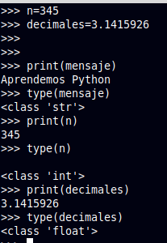
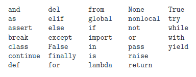

# Variables

## Valores

Un valor es una de las cosas básicas que utiliza un programa, como una letra o un número. Los valores que hemos visto hasta ahora han sido 1, 2, y “¡Hola, mundo!”

Esos valores pertenecen a tipos diferentes: *2* es un entero `int`, y “*¡Hola, mundo!*” es una cadena `string`, que recibe ese nombre porque  contiene una *cadena* de letras. Vosotros (y el intérprete) podréis identificar las cadenas porque van encerradas entre comillas.


## Variables y tipos de datos

Una de las características más potentes de un lenguaje de programación es la capacidad de manipular variables. Una variable es un nombre que se refiere a un valor.

Una sentencia de asignación crea variables nuevas y les da valores:



En Python cada valor que exista, tiene un tipo de dato, pero no es necesario declarar el tipo de las variables. ¿Como funciona? Basado en cada
asignación a la variable, Python deduce el tipo que es y lo conserva internamente.

Python proporciona muchos tipos de dato nativos. A continuación se muestran los más importantes:

1. **Booleanos:** Su valor es True o False.
2. **Números:** Pueden ser enteros (1, 2, 3,...), flotantes (1.1, 1.2, 1.3,...)[^1], fracciones (1/2, 1/3, 2/3,...), o incluso números complejos (raíz de -1).
3. **Cadenas**: Son secuencias de caracteres Unicode, por ejemplo, un documento HTML.

Como tipos de datos, destacaremos:

4. **Bytes y arrays de bytes:** por ejemplo, un fichero de imágenes JPEG.
5. **Listas:** Son secuencias ordenadas de valores.
6. **Tuplas:** Son secuencias ordenadas e <u>inmutables</u> de valores.
7. **Conjuntos:** Son “bolsas” de valores sin ordenar.
8. **Diccionarios:** Son “bolsas” de sin ordenar de parejas clave-valor. Es posible
buscar directamente por clave.

En la imagen anterior veíamos que teníamos valores de tipo número entero `int`, de tipo coma flotante `float`, así como una cadena de tipo string `str`.


[^1]:Los números decimales se representan utilizando un punto decimal. Aunque en español utilizamos la coma decimal usaremos aquí el punto decimal por ser el formato que se requiere en Python.

El nombre de una variable se conoce como **identificador**, y deberá cumplir las siguientes reglas:

- Comenzar con una letra o un guión bajo.
- El resto del nombre estará formado por letras, números o guiones bajos.
- Los nombres de las variables son *case sensitive*, es decir, no es lo mismo que una variable se llame `resultado` que `RESULTADO`.
- Existen una serie de palabras reservadas que no se pueden utilizar:
    
    


Algunas de las recomendaciones respecto a los nombres de las variables están recogidas en la [Guía oficial de Estilos PEP8 de Python](https://www.python.org/dev/peps/pep-0008/). Entre las más habituales encontramos las siguientes:

- Utilizar nombres descriptivos, en minúsculas y separados por guiones bajos si fuese necesario: `resultado`, `mi_variable`, `valor_anterior`,...
- Escribir las constantes en mayúsculas: `MI_CONSTANTE`, `NUMERO_PI`, ...
- Antes y después del signo `=`, debe haber uno (y solo un) espacio en blanco.

!!!note "Nota"
    No olvideis que lo que la guía plantea son recomendaciones y no obligaciones. Por ejemplo, mientras PEP8 recomienda tabular el código con 4 espacioes en blanco, la guía particular de los desarrolladores de Google habla de 2 espacios en lugar de 4.

## Lectura de datos en Python

La función `input()` permite introducir datos al usuario:

```python
>>> nombre = input()
Leire
>>> print(nombre)
Leire
```

Como se puede ver en el siguiente ejemplo, es posible también mostrar un mensaje al usuario, tal y como muestra el siguiente ejemplo.

```python
>>> nombre = input("Escribe tu nombre: ")
Escribe tu nombre: Leire
>>> print(nombre)
Leire
```

## Números
Python soporta dos tipos de números: enteros (integer) y de punto flotante (float).
 
 ```python
# integer
x = 5
print(x)

# float
y = 5.0
print(y)

# Otra forma de declarar un float
z = float(5)
print(z)
```

Si tenemos dudas del valor de una variable, podemos mostrar su tipo utilizando la función `type()`:

```python
>>> x = 5.5
>>> type(x)
<class 'float'>
```

## Cadenas de texto (string)
 Las cadenas de texto o strings se definen mediante comilla simple (`' '`) o doble comilla (`" "`):

```python
mi_nombre = 'Ane'
print(mi_nombre)
mi_nombre= "Ane"
print(mi_nombre)
```

La diferencia principal se encuentra en que las comillas dobles aportan mayor facilidad en textos que incluyan apóstrofes:

```python
mi_nombre = 'I\'m John'
print(mi_nombre)
mi_nombre= "I'm John"
print(mi_nombre)
```

Más información sobre strings y carácteres especiales en: [ https://docs.python.org/3/tutorial/introduction.html#strings](https://docs.python.org/3/tutorial/introduction.html#strings)

Para definir strings multi-línea se utiliza la triples comillas (`"""`):

```python
frase = """ esto es una
        frase muy larga de más de
        una línea ..."""
```

### Concatenación de strings
Es posible unir dos strings con el operador `+`:

```python
>>> primera_palabra = 'Hola'
>>> frase_completa = primera_palabra + ', mundo'
>>> print(frase_completa)
'Hola, mundo'

>>> segunda_palabra = 'mundo'
>>> frase_completa = primera_palabra + ', ' + segunda_palabra
>>> print(frase_completa)
'Hola, mundo'
```

**Método alternativo 1**: str.join():
El método `join()` recibe como argumento el listado (de tipo List, Tuple, String, Dictionary y Set) de strings que se desean concatenar. Se invoca sobre el separador que se utilizará para unir las cadenas (el cual a su vez es un string también):

```python
>>> strings = ['do', 're', 'mi']
>>> separador = ' - '
>>> separador.join(strings)
'do - re - mi'
```

Para iterar un elemento detrás del otro se introducirá string vacío como separador:

```python
>>> strings = ['do', 're', 'mi']
>>> ''.join(strings)
'doremi'
```
   
**Método alternativo 2**: `str.format()`:
Python 3 introdujo una nueva forma para formatear strings, la cual sustituye a la anterior en la que se hace uso del operador `%`. Para ello se invoca el método `format()` de un string:

```python
# Ordenado por defecto:
frase = "Meses: {}, {} y {}".format('Enero','Febrero','Marzo')
print(frase)

# Especificar el orden indicando la posición:
frase = "Meses: {1}, {0} y {2}".format('Enero','Febrero','Marzo')
print(frase)

# Especificar el orden mediante parejas clave-valor:
frase = "Meses: {ene}, {feb} y {mar}".format(ene='Enero', feb='Febrero',mar='Marzo')
print(frase)
```

### Cadenas 'f' (f-strings)
La versión 3.6 de Python trajo un gran avance a la hora de integrar variables o expreiones en cadenas de carácteres. Se introdujeron las llamadas `f-strings`, una forma más cómoda y directa para insertar variables y expresiones en cadenas. Permiten introducir cualquier variable o expresión dentro de un string incluyendo la variable entre llaves `{` y `}`.

Veamos un ejemplo:

```python
nombre = "Nora"
edad = 22
saludo = f"Me llamo {nombre} y tengo {edad} años."
```

Para indicar que se trata de un `f-string`, este deberá incluir la letra 'f' antes del comiendo de la cadena (antes de las comillas). A continuación se muestra otro ejemplo en el que se introduce una expresión:

```python
a = 4
b = 3
print(f"La multiplicación de {a} y {b} es igual a {a * b}")
```

### Conversión de tipos
A la hora de concatenar un string con otras variables como `integer` o `float` puede haber problemas:

```python
>>> edad = 25
>>> nota_media = 7.3
>>> print("Tengo " + edad + " años y mi nota media es " + nota_media + ".")

Traceback (most recent call last):
    File "<stdin>", line 1, in <module>
TypeError: can only concatenate str (not "int") to str
```

Mediante la función `str()` podemos convertir un valor a string y evitar así cualquier tipo de problema:

```python
>>> edad = 25
>>> nota_media = 7.3
>>> print("Tengo " + str(edad) + " años y mi nota media es " + str(nota_media) + ".")
Tengo 25 años y mi nota media es 7.3.
```

De igual manera es posible convertir a otros tipos con las funciones `int()`, `float()` and `bool()`.

### Métodos en cadenas de texto (string)

Es posible **obtener un carácter concreto** de un string utilizando los corchetes `[]` y el índice del carácter al que queremos acceder:

```python
frase = 'Aprendiendo a programar en Python'
frase[0] # devuelve el primer caracter
frase[1] # devuelve el segundo caracter
frase[-1] # devuelve el primer caracter empezando por el final
frase[-2] # # devuelve el segundo caracter empezando por el final
```

Si queremos **obtener un substring**, utilizaremos la siguiente notación:

```python
frase = 'Aprendiendo a programar en Python'
mi_substring = frase[1:5] 
# devuelverá los caracteres desde la posición 1 hasta la 5 (no incluye el 5)
```

En caso de dejar la primera variable vacía, se considera la primera posición del string. Dejando la segunda variable vacía se considera la última posición del string:

```python
>>> frase = 'Aprendiendo a programar en Python'
>>> mi_substring = frase[:5]
>>> mi_substring
'Apren'
>>> mi_substring = frase[4:]
>>> mi_substring
'ndiendo a programar en Python'
```

Otros métodos útiles de string:

```python
len(str) # devuelve la longitud del string
str.upper() # convierte a mayúsculas
str.lower() # convierte a minúsculas
str.title() # convierte a mayúsculas la primera letra de cada palabra
str.count(substring [, inicio, fin]) # devuelve el número de veces que aparece
# el substring en el string. Opcionalmente se puede indicar el inicio y fin. 
str.find(‘d’) # devuelve el índice de la primera aparición de 'd'
# (devolverá -1 si no lo encuentra)
substr in str # devuelve True si el string contiene el substring
str.replace(old, new [, count]) # reemplaza 'old' por 'new' un máximo de 'count' veces.
str.isnumeric() # devuelve True si str contiene solamente números
```

## Coding time!

### Ejercicio 1
Escribe un programa que contenga las siguientes variables:

 - `nombre`: tipo string y valor "Michael Jordan"
 - `edad`: tipo integer y valor 50
 - `media_puntos`: tipo float y valor 28.5
 - `activo`: False

El programa deberá mostrar en pantalla todos los valores.

### Ejercicio 2
Escribe un programa que solicite el nombre, DNI y edad, lo almacene en 3 variables distintas y muestre por pantalla los valores introducidos.

### Ejercicio 3
Escribe un programa que genere un string compuesto por los primeros 3 caracteres y los últimos 3 caracteres de un string introducido por el usuario. Pista: tendrás que utilizar la función `len()` en la obtención de los últimos 3 caracteres.

- Ejemplo 1: 'aprendiendo'  
- Resultado 1: 'aprndo'  
- Ejemplo 2: 'escribiendo código'  
- Resultado 2: 'escigo' 

### Ejercicio 4
Escribe un programa que solicite al usuario dos números y una frase. El primer número introducido se corresponderá a la posición de inicio del substring que deberá mostrar el programa por pantalla. El segundo número indicará la longitud de dicho substring.
 
- Ejemplo 1: Posicion=4, Longitud=8, Frase='Desarrollar es mi nueva afición'  
- Resultado 1: "rrollar "  
- Ejemplo 2: Posicion=8, Longitud=11, Frase='Bienvenido a la clase de programación'
- Resultado 2: "do a la cla"

### Ejercicio 5
Escribe un programa que solicite al usuario una frase. A continuación le solicitará la letra que quiere reemplazar y por qué letra deberá reemplazarse. Por último el programa mostrará el número de veces que la letra está presente en la frase y el resultado final tras reemplazarla.
 
- Ejemplo: 'Desarrollar es mi nuevo pasatiempos', 'a','e'
- Resultado: 4 apariciones. 'Deserroller es mi nueve pesetiempos'  
